# Mobile Development Workshop 2022

## Flutter Installation

### MacOS

#### Customised Way
The lazy way may not apply to you if you wish to do some customisation of the installation process such as you wish to use `flutter` as a global command.

Please visit https://docs.flutter.dev/get-started/install/macos for more information.

#### Lazy way
The lazy way of installing flutter is to use the `mac_config.sh` script inside of this repo.

```bash
export PATH="$PATH:`pwd`/flutter/bin"
```

The script basically does 3 things.
1. Download the zip of Flutter SDK
2. Unzip it to the current directory
3. Add the SDK bin directory to the $PATH variable

To run it, you need to first give an executable permission
```bash
chmod +x ./mac_config.sh
```

Then you can run the script
```bash
sh ./mac_config.sh
```

Notice this way sets your PATH variable for the current terminal window only, please look at the ***Customised Way*** for global `flutter` command usage. Everytime you restart the terminal you need to retype the following command again.

### Windows

**Step 1**

 Download the flutter SDK from https://docs.flutter.dev/get-started/install/windows and unzip it

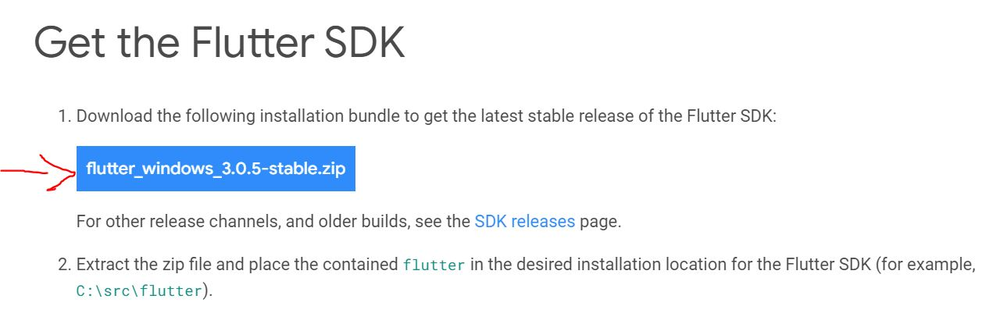

Here I got it under `D:\DEVS`

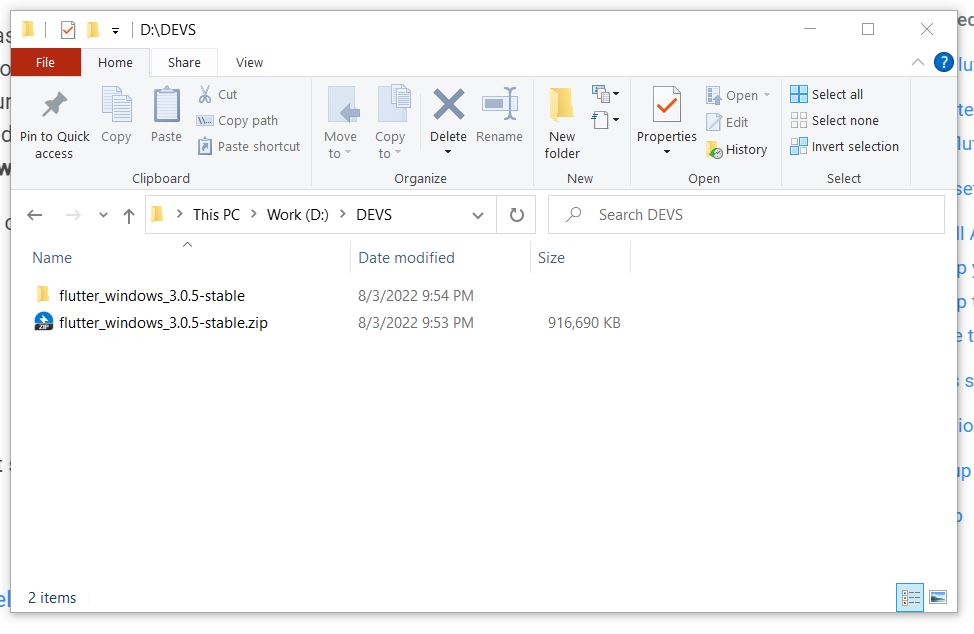

**Step 2**

Add Flutter to the PATH environment variable

From the Start search bar (Shortcut: `win` + `s`), enter ‘env’ and select Edit environment variables for your account.

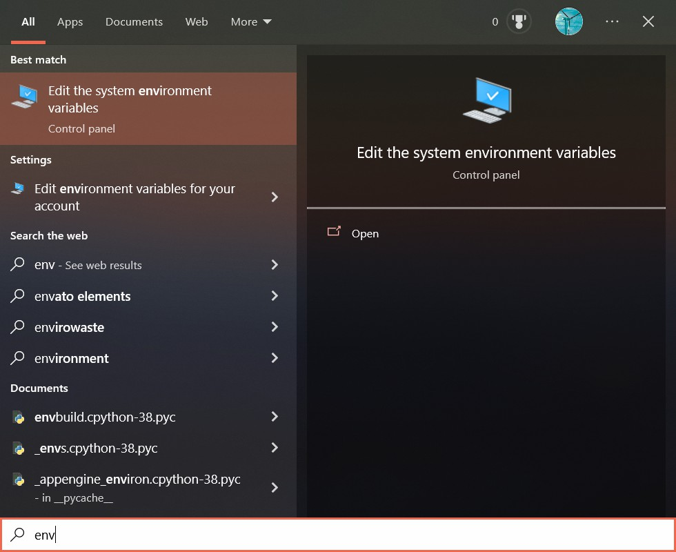

Under User variables check if there is an entry called Path.

- If the entry exists, you can follow the instructions and add the full path of **flutter\bin** in the pop up `Edit environment variable` window.

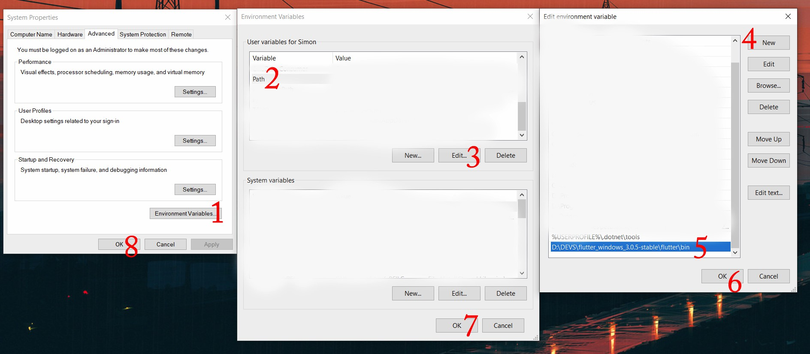

- Or after clicking `Edit`, the **Edit User Variable** window pops up, then you append the full path to **flutter\bin** using `;` as a separator from existing values.

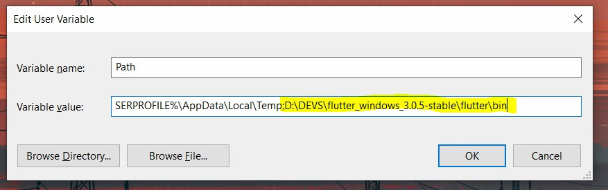

- Or if the entry does not exist, you can click on `New..` and create the new entry.

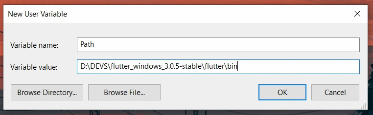

***Trick*** - the full path of **flutter\bin** can be copy from the address bar in the File Explorer

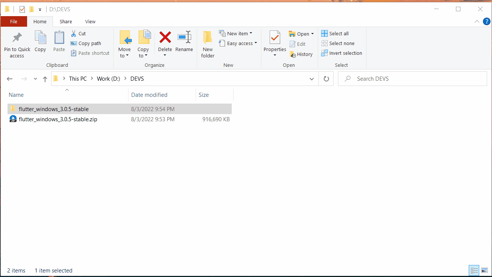

**Step 3**

Check if adding successfully

If you have configured it successfully, by typing 
```bash
flutter --version
```
in the command prompt, you should be able to see the version information of flutter

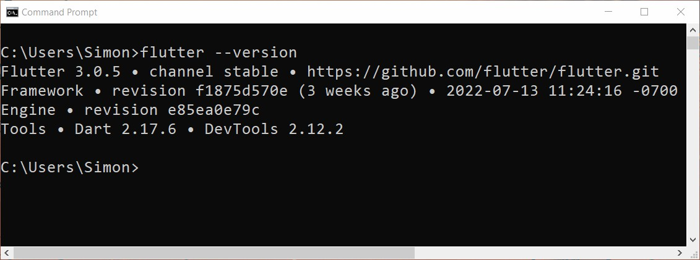

> Q: What if I did not configure it successfully?

Say there is something went wrong in your path and something like this shows up.

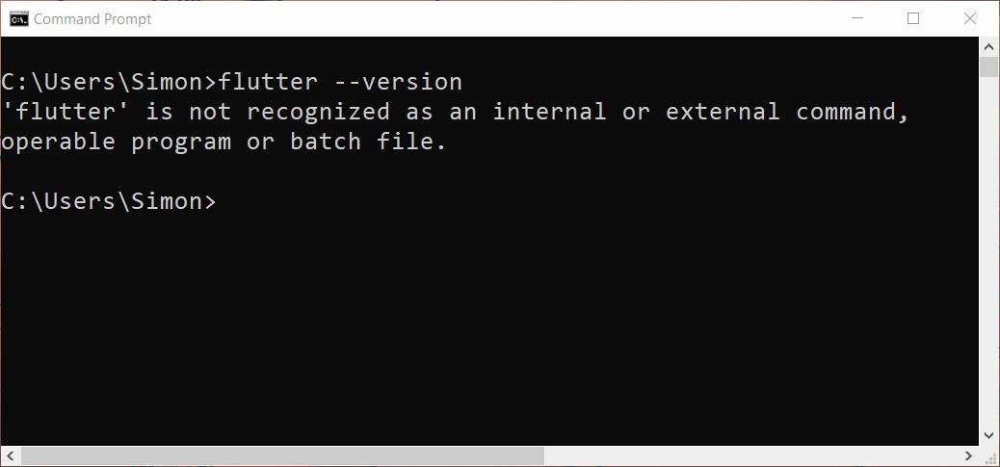

Well, imagine you might already felt tired with the path configuration process. It is equivalent to use the full path of `flutter.bat` as a command directly in the command prompt. In my case,

```bat
D:\DEVS\flutter_windows_3.0.5-stable\flutter\bin\flutter.bat --version
```

is the same assets
```bat
flutter --version
```
 
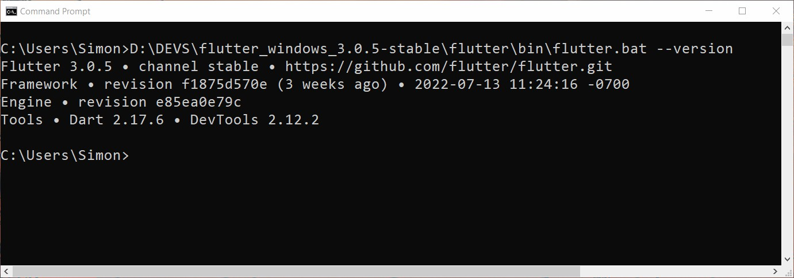

## VS Code Configuration

1 Install Visual Studio Code
Select the right edition of VS Code for your device from https://code.visualstudio.com/

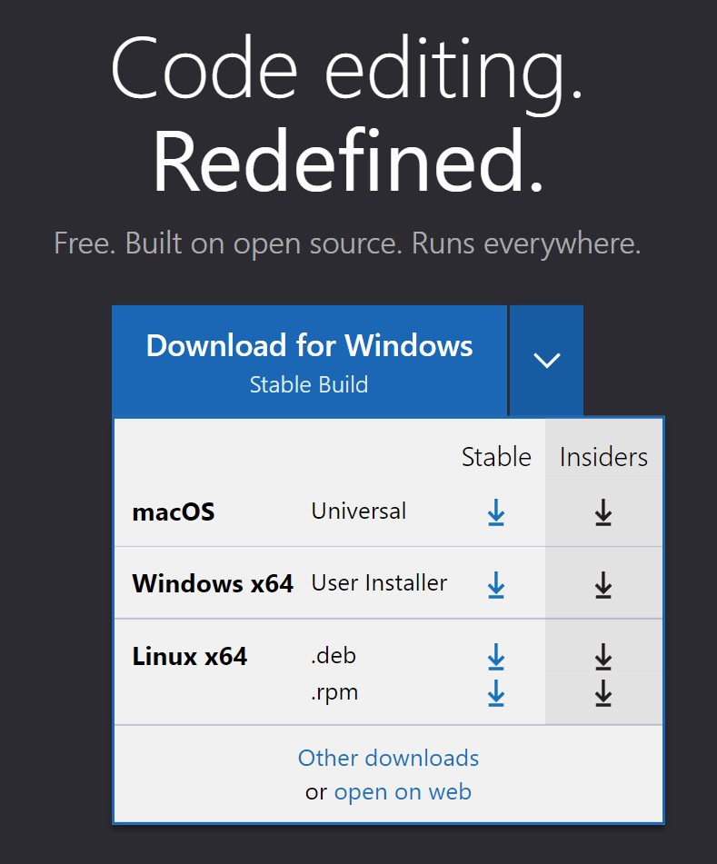

2. Install Flutter Extension


